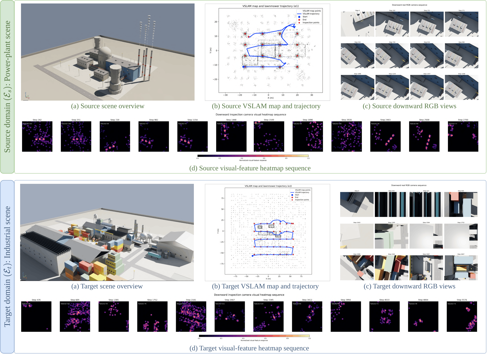
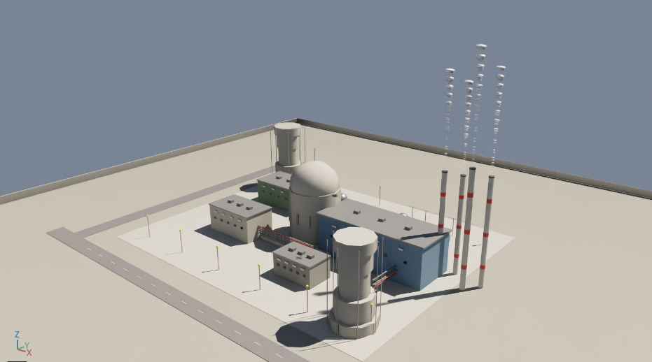
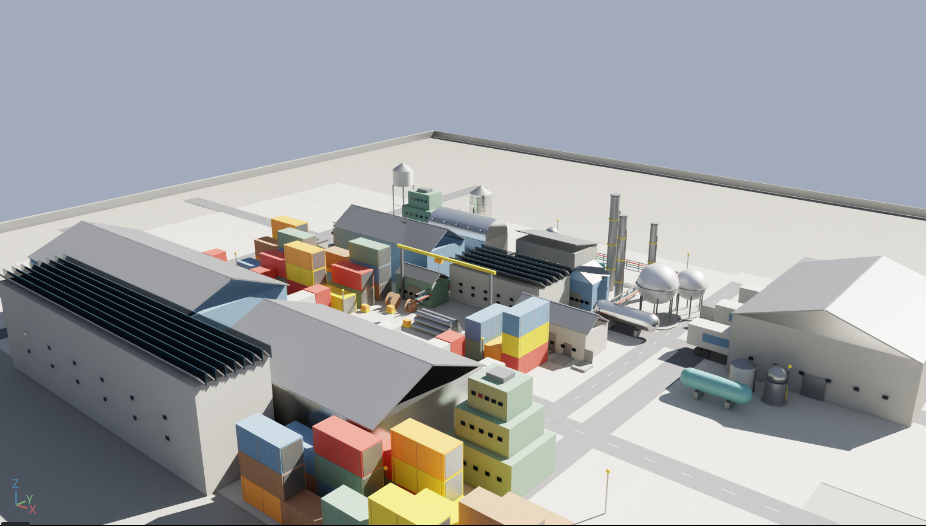
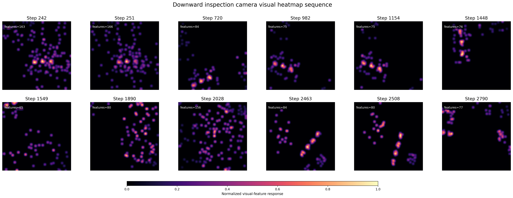
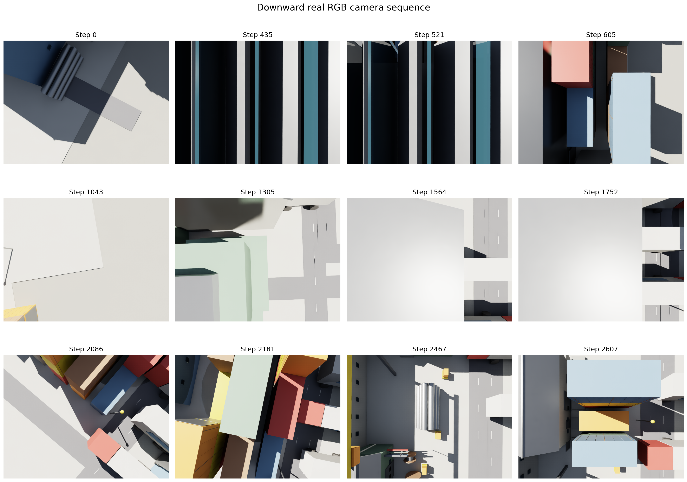
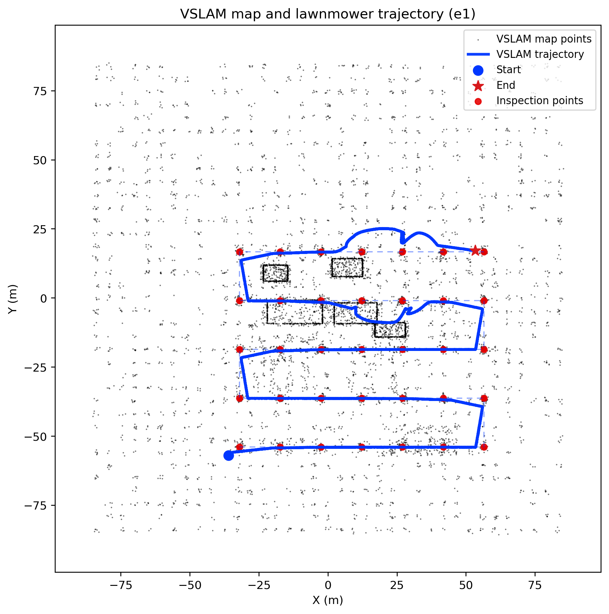

# Robust Speed Control for UAV Infrastructure Inspection Under Visual Localization Degradation

**UAV-LLM-DRL: mission-conditioned PPO speed proposal, VSLAM-risk correction, and deterministic command checking for GPS-denied infrastructure inspection**

[](https://www.python.org/)
[](https://developer.nvidia.com/isaac/sim)
[](https://isaac-sim.github.io/IsaacLab/)
[](https://docs.ros.org/)
[](#method-summary)
[](#deterministic-command-checking)

> **Paper:** Robust Speed Control for UAV Infrastructure Inspection Under Visual Localization Degradation  
> **Repository:** <https://github.com/szu-ai/uav-llm-drl>  
> **Project folder:** `uav-llm-drl-main`  
> **Authors:** Uddin Md. Borhan, Arif Raza, Bo Lv, Jianqiang Li, and Jie Chen  
> **Affiliation:** Shenzhen University  
> **Core idea:** a learned policy proposes speed, but the final UAV command is produced only after VSLAM-risk correction, route/corridor checking, yaw checking, rate limiting, and fallback logic.

---

## Overview

<p align="justify">
This repository contains code, data archives, figures, visual inspection outputs, and evaluation graphs for <b>Robust Speed Control for UAV Infrastructure Inspection Under Visual Localization Degradation</b>. The work studies planned-route UAV inspection in GPS-denied infrastructure environments, where visual localization may become unreliable because of smoke, low texture, repetitive industrial structures, illumination variation, motion blur, yaw drift, and temporary tracking loss.
</p>

<p align="justify">
The problem is not open-ended route planning. The UAV already has a fixed inspection route. The main question is how the vehicle should regulate forward speed when visual localization quality changes along that route. The proposed controller uses a PPO policy to propose a bounded speed, but the policy is not allowed to directly command the UAV. A deterministic command-checking layer verifies the proposed command before execution.
</p>

<p align="justify">
The repository name includes historical script names such as <code>uav_llm.py</code> and <code>uav_gpt.py</code>. In the paper-aligned setting, the language model is not used at the control rate. Mission text is converted once per episode into a numeric mission-risk context. The controller then receives only the bounded mission vector and scalar risk preference.
</p>

---

## Method Summary

<p align="justify">
The system separates learning from execution-time safety. The PPO policy samples a raw action and maps it to a nominal speed. A VSLAM-risk rule reduces the speed when localization health degrades. The command gate then checks corridor error, yaw error, tracking loss, VSLAM risk, speed bounds, rate limits, and abort conditions before sending the command to the autopilot interface.
</p>

```text
mission text T
    |
    v
mission encoder E(T) -> numeric mission vector m and risk preference lambda
    |
    v
observation o_t + mission m -> PPO policy -> raw action a_t -> nominal speed v_t
    |
    v
VSLAM health h_t -> risk score z_t -> risk-adjusted speed v_hat_t
    |
    v
command governor checks corridor, yaw, tracking loss, risk, and abort limits
    |
    v
checked command v_c_t -> autopilot interface / simulation control
```

### Main components

| Component | Role |
|---|---|
| PPO speed policy | Proposes a bounded forward speed from online UAV state and mission context. |
| VSLAM-risk score | Increases when feature support/inlier quality falls or uncertainty/tracking loss rises. |
| Mission-risk encoder | Converts closed-template mission text into a numeric vector and scalar risk level once per episode. |
| Deterministic governor | Accepts, trims, rejects, hovers, or aborts commands using explicit safety checks. |
| Drift-tail validation | Reports drift return and empirical CVaR so rare high-drift episodes are visible. |
| Zero-shot transfer | Trains in the source power-plant scene and evaluates in the target industrial scene without target updates. |

---

## System Figures

### Unified framework

<p align="justify">
The main framework figure in <code>figs/framework.png</code> shows the full information flow: mission encoding, PPO speed proposal, VSLAM-health risk scoring, deterministic stack-level command checking, autopilot execution, and paired source-target validation. GitHub may open PDF figures in a separate preview tab.
</p>

<p align="center">
  <a href="./figs/framework.png"><b>Open framework figure: figs/framework.png</b></a>
</p>

### Inspection and validation procedure

<p align="center">
  
</p>

<p align="justify">
The inspection figure summarizes the Isaac Sim validation procedure. The UAV follows a corridor-bounded route, adapts speed under VSLAM risk, logs route progress, and compares source and target behavior using drift-sensitive metrics.
</p>

### Source and target domains

<p align="center">
  
  
</p>

<p align="justify">
The source domain is a visually challenging power-plant inspection scene with smoke, repetitive structures, weak textures, and localization-degraded segments. The target domain is a longer industrial route used for zero-shot evaluation.
</p>

---

## Repository Layout

```text
uav-llm-drl-main/
├── code/
│   ├── a.txt
│   ├── uav_e2_eval_baselines.py
│   ├── uav_e2_fixed_governor.py
│   ├── uav_e2_fixed_no_governor.py
│   ├── uav_fixed_governor.py
│   ├── uav_fixed_no_governor.py
│   ├── uav_fix.py
│   ├── uav_gpt.py
│   ├── uav_llm_e2.py
│   ├── uav_llm.py
│   ├── uav_pid_e2.py
│   └── uav_pid.py
│
├── data/
│   ├── a.txt
│   ├── e1.zip
│   ├── eval.zip
│   ├── other.zip
│   ├── seeds.zip
│   ├── speed.zip
│   └── uav_llm.zip
│
├── fig2/
│   ├── a.txt
│   ├── e1/
│   │   ├── a.txt
│   │   ├── downcam_heatmap_ep0019.png
│   │   ├── downcam_heatmap_sequence_ep0020.png
│   │   ├── downcam_rgb_sequence_ep0020.png
│   │   ├── episode_0020_bottom_visual_heatmap_sequence.png
│   │   └── episode_0020_vslam_trajectory.png
│   ├── e2/
│   │   ├── a.txt
│   │   ├── downcam_heatmap_ep0020.png
│   │   ├── downcam_rgb_sequence_ep0020.png
│   │   ├── episode_0019_vslam_trajectory.png
│   │   ├── episode_0020_bottom_visual_heatmap_sequence.png
│   │   └── episode_0020_vslam_trajectory.png
│   ├── indust.png
│   └── power.png
│
├── figs/
│   ├── a.txt
│   ├── framework.png
│   └── inspect.png
│
├── graphs/
│   ├── a.txt
│   ├── drift_speed_tradeoff.pdf
│   ├── override.pdf
│   └── vslam_error_loss.pdf
│
└── README.md
```

---

## Code Tour

| Script | Main role | Typical use |
|---|---|---|
| `code/uav_llm.py` | Main source-domain mission-conditioned PPO workflow with VSLAM-risk speed correction, command governor, logging, and RGB capture options. | Train or evaluate the proposed controller in the power-plant source domain `e1`. |
| `code/uav_llm_e2.py` | Target-domain evaluation script for the proposed method. | Load an `e1` trained policy and run zero-shot industrial target-domain evaluation `e2`. |
| `code/uav_gpt.py` | Mission-conditioned workflow variant for local LLM or OpenAI-backed mission encoding experiments. | Run DeepSeek, TinyLlama, or ChatGPT-style mission encoder ablations. |
| `code/uav_fix.py` | Corrected source-domain workflow used for stable paper-aligned proposed runs. | Re-run source-domain proposed method with fixed/governed settings. |
| `code/uav_fixed_no_governor.py` | Fixed-speed source-domain baseline without deterministic governor. | Measures behavior when speed is not corrected by the command checker. |
| `code/uav_fixed_governor.py` | Fixed-speed source-domain baseline with deterministic governor. | Isolates the benefit of command checking without learned speed adaptation. |
| `code/uav_e2_fixed_no_governor.py` | Target-domain fixed-speed baseline without governor. | Zero-shot target baseline for uncontrolled fixed-speed execution. |
| `code/uav_e2_fixed_governor.py` | Target-domain fixed-speed baseline with governor. | Zero-shot target baseline for governor-only control. |
| `code/uav_pid.py` | Source-domain PID speed-control baseline with governor. | Compares the learned proposal with a hand-tuned speed scheduler. |
| `code/uav_pid_e2.py` | Target-domain PID speed-control baseline with governor. | Evaluates PID transfer behavior in the industrial target domain. |
| `code/uav_e2_eval_baselines.py` | Target-domain baseline evaluation helper. | Batch evaluation or table-generation support for target-domain baselines. |

---

## Data Archives

<p align="justify">
The <code>data/</code> folder stores compressed experiment artifacts. These archives can be used to inspect outputs, reproduce tables, or regenerate plots without rerunning all Isaac Sim experiments.
</p>

| Archive | Purpose |
|---|---|
| `data/e1.zip` | Source-domain power-plant runs, logs, or visual records. |
| `data/eval.zip` | Evaluation outputs and summaries used for reporting. |
| `data/seeds.zip` | Multi-seed outputs for robustness checks. |
| `data/speed.zip` | Speed-control, governor, and sweep artifacts. |
| `data/uav_llm.zip` | Proposed method outputs and mission-conditioned records. |
| `data/other.zip` | Auxiliary experiment artifacts. |

Extract archives as needed:

```bash
mkdir -p extracted
unzip data/e1.zip -d extracted/e1
unzip data/eval.zip -d extracted/eval
unzip data/seeds.zip -d extracted/seeds
unzip data/speed.zip -d extracted/speed
unzip data/uav_llm.zip -d extracted/uav_llm
```

---

## Visual Outputs

### Source-domain visual artifacts

<p align="center">
  
  
</p>

<p align="justify">
These source-domain figures show downward camera views and heatmap-style feature/localization evidence from the power-plant inspection scene.
</p>

### Target-domain visual artifacts

<p align="center">
  
  
</p>

<p align="justify">
These target-domain figures show the industrial zero-shot evaluation scene and its corresponding visual feature evidence.
</p>

### VSLAM trajectory examples

<p align="center">
  
  
</p>

---

## Paper Graphs

GitHub may open the PDF graphs in separate preview pages:

- [`graphs/vslam_error_loss.pdf`](./graphs/vslam_error_loss.pdf) — ATE and tracking-loss comparison.
- [`graphs/drift_speed_tradeoff.pdf`](./graphs/drift_speed_tradeoff.pdf) — drift return, CVaR drift, and speed trade-off.
- [`graphs/override.pdf`](./graphs/override.pdf) — command-governor override and gate behavior.

---

## Reported Target-Domain Results

<p align="justify">
The paper evaluates the source-trained controller zero-shot in the industrial target domain. The following values summarize the seed-7 target-domain comparison reported in the manuscript. Small differences can occur if simulator settings, random seeds, rendering options, or VSLAM proxy parameters are changed.
</p>

| Method | Policy speed (m/s) | ATE (m) ↓ | Track loss (%) ↓ | Override (%) ↓ | Gate (%) | Drift ↓ | CVaR ↓ |
|---|---:|---:|---:|---:|---:|---:|---:|
| Fixed speed without governor | 1.350 | 0.0350 | 0.111 | 0.000 | 100.000 | 5.520 | 6.215 |
| Fixed speed with governor | 1.140 | 0.0350 | 0.119 | 35.465 | 69.167 | 4.321 | 5.043 |
| PID speed control with governor | 1.110 | 0.0440 | 0.506 | 48.692 | 84.053 | 4.371 | 5.110 |
| Proposed PPO speed control with governor | 1.185 | **0.0341** | **0.103** | **23.772** | 83.943 | **4.060** | **4.488** |

---

## Requirements

### Recommended platform

- Ubuntu 20.04 / 22.04
- NVIDIA GPU with a recent driver for GPU evaluation
- NVIDIA Isaac Sim / Isaac Lab environment
- Python 3.10+
- ROS 2 if using ROS logging, bridge, or VSLAM-related topics
- Optional local Hugging Face model for `llama_hf` mission encoding
- Optional OpenAI API access only for `openai_chatgpt` mission-encoder ablations

### Minimal Python packages

The scripts should be launched through Isaac Lab so that Isaac Sim modules are available. The additional Python layer typically includes:

```bash
pip install numpy gymnasium stable-baselines3 torch transformers
```

### Prepare scripts inside Isaac Lab

The execution commands below assume that the scripts are available under:

```text
~/IsaacLab/source/standalone/uav_llm/
```

Copy the repository scripts into that folder:

```bash
mkdir -p ~/IsaacLab/source/standalone/uav_llm
cp code/*.py ~/IsaacLab/source/standalone/uav_llm/
```

---

## How to Run

> **Important:** The commands below intentionally use placeholders for private credentials. Do not commit API keys, local tokens, private checkpoints, or machine-specific secrets to GitHub.

### 1. DeepSeek training on source domain `e1`

This run trains the proposed mission-conditioned policy in the power-plant source domain using a local DeepSeek model as the mission encoder.

```bash
cd ~/IsaacLab && \
unset PYTHONPATH AMENT_PREFIX_PATH CMAKE_PREFIX_PATH COLCON_PREFIX_PATH && \
nohup ./isaaclab.sh -p source/standalone/uav_llm/uav_llm.py \
  --mode train \
  --device cpu \
  --render-train \
  --render-step-interval 50 \
  --viewer-mode plant \
  --capture-rgb \
  --capture-every-episode 10 \
  --mission-encoder llama_hf \
  --hf-llama-model /home/umb/models/DeepSeek-R1-Distill-Qwen-1.5B \
  --hf-local-files-only \
  --llm-max-new-tokens 96 \
  --mission-text "E:low-texture G:coverage S:feature-slow O:slow-smooth" \
  --total-timesteps 600000 \
  --max-episode-steps 9000 \
  --speed-min 0.05 \
  --speed-max 1.35 \
  --governor-alpha 0.28 \
  --governor-beta 0.10 \
  --governor-rate-limit 0.65 \
  --vslam-risk-limit 0.86 \
  --abort-risk-limit 0.98 \
  --corridor-limit 5.5 \
  --abort-corridor-limit 11.0 \
  --yaw-limit-deg 110 \
  --abort-yaw-limit-deg 170 \
  --route-repeat-count 1 \
  --seed 7 \
  --output-root ~/uav_results_e1_deepseek_train \
  > ~/uav_results_e1_deepseek_train.log 2>&1 &
```

Check progress:

```bash
tail -f ~/uav_results_e1_deepseek_train.log
```

### 2. DeepSeek evaluation on source domain `e1`

```bash
cd ~/IsaacLab && \
unset PYTHONPATH AMENT_PREFIX_PATH CMAKE_PREFIX_PATH COLCON_PREFIX_PATH && \
./isaaclab.sh -p source/standalone/uav_llm/uav_llm.py \
  --mode eval \
  --device cpu \
  --render-train \
  --render-step-interval 50 \
  --viewer-mode plant \
  --capture-rgb \
  --capture-every-episode 1 \
  --mission-encoder llama_hf \
  --hf-llama-model /home/umb/models/DeepSeek-R1-Distill-Qwen-1.5B \
  --hf-local-files-only \
  --llm-max-new-tokens 96 \
  --mission-text "E:low-texture G:coverage S:feature-slow O:slow-smooth" \
  --model-path ~/uav_results_e1_deepseek_train/models/power_plant_ppo.zip \
  --eval-episodes 20 \
  --max-episode-steps 9000 \
  --speed-min 0.05 \
  --speed-max 1.35 \
  --governor-alpha 0.28 \
  --governor-beta 0.10 \
  --governor-rate-limit 0.65 \
  --vslam-risk-limit 0.86 \
  --abort-risk-limit 0.98 \
  --corridor-limit 5.5 \
  --abort-corridor-limit 11.0 \
  --yaw-limit-deg 110 \
  --abort-yaw-limit-deg 170 \
  --route-repeat-count 1 \
  --seed 17 \
  --output-root ~/uav_results_e1_deepseek_eval20
```

### 3. DeepSeek zero-shot evaluation on target domain `e2`

This command loads the source-domain checkpoint and evaluates it in the industrial target domain without target-domain policy updates.

```bash
cd ~/IsaacLab && \
unset PYTHONPATH AMENT_PREFIX_PATH CMAKE_PREFIX_PATH COLCON_PREFIX_PATH && \
PYTHONUNBUFFERED=1 ./isaaclab.sh -p source/standalone/uav_llm/uav_llm_e2.py \
  --mode eval \
  --device cuda \
  --render-train \
  --render-step-interval 30 \
  --viewer-mode industrial \
  --slam-mode proxy \
  --capture-rgb \
  --capture-every-episode 1 \
  --mission-encoder structured \
  --mission-text "E:low-texture G:coverage S:feature-slow O:slow-smooth" \
  --model-path ~/uav_results_e1_deepseek_train/models/power_plant_ppo.zip \
  --eval-episodes 20 \
  --max-episode-steps 9000 \
  --speed-min 0.05 \
  --speed-max 1.35 \
  --governor-alpha 0.28 \
  --governor-beta 0.10 \
  --governor-rate-limit 0.65 \
  --vslam-risk-limit 0.86 \
  --abort-risk-limit 0.98 \
  --corridor-limit 5.5 \
  --abort-corridor-limit 11.0 \
  --yaw-limit-deg 110 \
  --abort-yaw-limit-deg 170 \
  --route-repeat-count 1 \
  --seed 27 \
  --output-root ~/uav_results_e2_deepseek_eval20_proxy_capture
```

### 4. VSLAM-heuristic baseline on source domain `e1`

```bash
cd ~/IsaacLab && \
unset PYTHONPATH AMENT_PREFIX_PATH CMAKE_PREFIX_PATH COLCON_PREFIX_PATH && \
PYTHONUNBUFFERED=1 ./isaaclab.sh -p source/standalone/uav_llm/uav_vslam_heuristic.py \
  --mode eval \
  --device cuda \
  --render-train \
  --render-step-interval 30 \
  --viewer-mode plant \
  --slam-mode proxy \
  --capture-rgb \
  --capture-every-episode 1 \
  --mission-encoder structured \
  --mission-text "E:low-texture G:coverage S:feature-slow O:slow-smooth" \
  --eval-episodes 20 \
  --max-episode-steps 9000 \
  --speed-min 0.05 \
  --speed-max 1.35 \
  --governor-alpha 0.28 \
  --governor-beta 0.10 \
  --governor-rate-limit 0.65 \
  --vslam-risk-limit 0.86 \
  --abort-risk-limit 0.98 \
  --corridor-limit 5.5 \
  --abort-corridor-limit 11.0 \
  --yaw-limit-deg 110 \
  --abort-yaw-limit-deg 170 \
  --route-repeat-count 1 \
  --base-wind-mps 1.15 \
  --wind-jitter 0.20 \
  --base-illumination-lux 620 \
  --illumination-jitter 40 \
  --seed 17 \
  --output-root ~/uav_results_e1_vslam_heuristic_wind_eval20
```

> Note: this command requires `uav_vslam_heuristic.py` to exist inside your Isaac Lab `source/standalone/uav_llm/` folder. If it is not present in this repository snapshot, add the script before running the command.

### 5. TinyLlama training on source domain `e1`

```bash
cd ~/IsaacLab && \
./isaaclab.sh -p source/standalone/uav_llm/uav_llm.py \
  --mode train \
  --device cpu \
  --render-train \
  --render-step-interval 20 \
  --viewer-mode plant \
  --capture-rgb \
  --capture-every-episode 5 \
  --mission-encoder llama_hf \
  --hf-llama-model TinyLlama/TinyLlama-1.1B-Chat-v1.0 \
  --hf-local-files-only \
  --mission-text "E:low-texture G:coverage S:feature-slow O:slow-smooth" \
  --total-timesteps 600000 \
  --max-episode-steps 6000 \
  --speed-max 1.35 \
  --governor-alpha 0.22 \
  --governor-beta 0.06 \
  --governor-rate-limit 0.75 \
  --vslam-risk-limit 0.92 \
  --abort-risk-limit 0.995 \
  --corridor-limit 5.5 \
  --abort-corridor-limit 11.0 \
  --yaw-limit-deg 110 \
  --abort-yaw-limit-deg 170 \
  --seed 7 \
  --output-root ~/uav_results_e1_gui_llm
```

### 6. TinyLlama evaluation on source domain `e1`

```bash
cd ~/IsaacLab && \
./isaaclab.sh -p source/standalone/uav_llm/uav_llm.py \
  --mode eval \
  --device cpu \
  --render-step-interval 20 \
  --viewer-mode plant \
  --capture-rgb \
  --capture-every-episode 1 \
  --mission-encoder llama_hf \
  --hf-llama-model TinyLlama/TinyLlama-1.1B-Chat-v1.0 \
  --hf-local-files-only \
  --mission-text "E:low-texture G:coverage S:feature-slow O:slow-smooth" \
  --eval-episodes 20 \
  --max-episode-steps 6000 \
  --speed-max 1.35 \
  --governor-alpha 0.22 \
  --governor-beta 0.06 \
  --governor-rate-limit 0.75 \
  --vslam-risk-limit 0.92 \
  --abort-risk-limit 0.995 \
  --corridor-limit 5.5 \
  --abort-corridor-limit 11.0 \
  --yaw-limit-deg 110 \
  --abort-yaw-limit-deg 170 \
  --model-path ~/uav_results_e1_gui_llm/models/power_plant_ppo.zip \
  --seed 7 \
  --output-root ~/uav_results_e1_eval20_gui
```

### 7. TinyLlama zero-shot evaluation on target domain `e2`

```bash
cd ~/IsaacLab && \
./isaaclab.sh -p source/standalone/uav_llm/uav_llm_e2.py \
  --mode eval \
  --device cpu \
  --render-step-interval 20 \
  --viewer-mode industrial \
  --capture-rgb \
  --capture-every-episode 1 \
  --mission-encoder llama_hf \
  --hf-llama-model TinyLlama/TinyLlama-1.1B-Chat-v1.0 \
  --hf-local-files-only \
  --mission-text "E:low-texture G:coverage S:feature-slow O:slow-smooth" \
  --eval-episodes 20 \
  --max-episode-steps 6000 \
  --speed-max 1.35 \
  --governor-alpha 0.22 \
  --governor-beta 0.06 \
  --governor-rate-limit 0.75 \
  --vslam-risk-limit 0.92 \
  --abort-risk-limit 0.995 \
  --corridor-limit 5.5 \
  --abort-corridor-limit 11.0 \
  --yaw-limit-deg 110 \
  --abort-yaw-limit-deg 170 \
  --model-path ~/uav_results_e1_gui_llm/models/power_plant_ppo.zip \
  --seed 7 \
  --output-root ~/uav_results_e2_eval20_gui
```

### 8. DeepSeek training with `uav_gpt.py`

```bash
cd ~/IsaacLab && \
./isaaclab.sh -p source/standalone/uav_llm/uav_gpt.py \
  --mode train \
  --device cpu \
  --render-train \
  --render-step-interval 20 \
  --viewer-mode plant \
  --capture-rgb \
  --capture-every-episode 5 \
  --mission-encoder llama_hf \
  --hf-llama-model /home/umb/models/DeepSeek-R1-Distill-Qwen-1.5B \
  --hf-local-files-only \
  --llm-max-new-tokens 96 \
  --mission-text "E:low-texture G:coverage S:feature-slow O:slow-smooth" \
  --total-timesteps 600000 \
  --max-episode-steps 6000 \
  --speed-max 1.35 \
  --governor-alpha 0.22 \
  --governor-beta 0.06 \
  --governor-rate-limit 0.75 \
  --vslam-risk-limit 0.92 \
  --abort-risk-limit 0.995 \
  --corridor-limit 5.5 \
  --abort-corridor-limit 11.0 \
  --yaw-limit-deg 110 \
  --abort-yaw-limit-deg 170 \
  --seed 7 \
  --output-root ~/uav_results_e1_gui_deepseek
```

### 9. ChatGPT/OpenAI mission-encoder training with `uav_gpt.py`

<p align="justify">
Use this only for mission-encoder ablation. Do not paste real API keys into README files, scripts, notebooks, Git commits, terminal logs, or screenshots. Store the key in your shell environment or secret manager.
</p>

```bash
export OPENAI_API_KEY="YOUR_OPENAI_API_KEY_HERE"

cd ~/IsaacLab && \
export OPENSSL_CONF="/tmp/openssl_tls12.cnf" && \
export http_proxy="http://127.0.0.1:7899" && \
export https_proxy="http://127.0.0.1:7899" && \
export HTTP_PROXY="http://127.0.0.1:7899" && \
export HTTPS_PROXY="http://127.0.0.1:7899" && \
export ALL_PROXY="http://127.0.0.1:7899" && \
export NO_PROXY="localhost,127.0.0.1" && \
./isaaclab.sh -p source/standalone/uav_llm/uav_gpt.py \
  --mode train \
  --device cpu \
  --render-train \
  --render-step-interval 20 \
  --viewer-mode plant \
  --capture-rgb \
  --capture-every-episode 5 \
  --mission-encoder openai_chatgpt \
  --openai-model gpt-4o-mini \
  --mission-text "E:low-texture G:coverage S:feature-slow O:slow-smooth" \
  --total-timesteps 600000 \
  --max-episode-steps 6000 \
  --speed-max 1.35 \
  --governor-alpha 0.22 \
  --governor-beta 0.06 \
  --governor-rate-limit 0.75 \
  --vslam-risk-limit 0.92 \
  --abort-risk-limit 0.995 \
  --corridor-limit 5.5 \
  --abort-corridor-limit 11.0 \
  --yaw-limit-deg 110 \
  --abort-yaw-limit-deg 170 \
  --seed 7 \
  --output-root ~/uav_results_e1_gui_chatgpt
```

---

## Suggested Baseline Runs

<p align="justify">
The paper compares the proposed PPO speed controller with fixed-speed and PID-style baselines. The scripts below should be run with the same route, mission, speed limits, VSLAM proxy, and governor thresholds so the comparisons remain fair.
</p>

```bash
# Source fixed speed without governor
cd ~/IsaacLab
./isaaclab.sh -p source/standalone/uav_llm/uav_fixed_no_governor.py --mode eval --viewer-mode plant

# Source fixed speed with governor
./isaaclab.sh -p source/standalone/uav_llm/uav_fixed_governor.py --mode eval --viewer-mode plant

# Source PID + governor
./isaaclab.sh -p source/standalone/uav_llm/uav_pid.py --mode eval --viewer-mode plant

# Target fixed speed without governor
./isaaclab.sh -p source/standalone/uav_llm/uav_e2_fixed_no_governor.py --mode eval --viewer-mode industrial

# Target fixed speed with governor
./isaaclab.sh -p source/standalone/uav_llm/uav_e2_fixed_governor.py --mode eval --viewer-mode industrial

# Target PID + governor
./isaaclab.sh -p source/standalone/uav_llm/uav_pid_e2.py --mode eval --viewer-mode industrial
```

Add the detailed flags from the proposed evaluation commands when reproducing paper tables.

---

## Output Folders

Typical runs create folders such as:

```text
~/uav_results_e1_deepseek_train/
├── models/
│   └── power_plant_ppo.zip
├── logs/
├── captures/
└── summaries/

~/uav_results_e2_deepseek_eval20_proxy_capture/
├── logs/
├── captures/
└── summaries/
```

Useful outputs include:

- trained PPO checkpoint: `models/power_plant_ppo.zip`
- per-episode CSV logs
- RGB and heatmap captures
- VSLAM proxy trajectory plots
- summary metrics for ATE, tracking loss, override rate, gate acceptance, drift, and CVaR

---

## Metrics

| Metric | Meaning | Direction |
|---|---|---|
| ATE `E^a` | Absolute trajectory error. | Lower is better. |
| Tracking loss `ell` | Percentage of time with VSLAM tracking loss. | Lower is better. |
| Policy speed `v_bar^p` | Mean proposed speed before final command gate. | Interpreted with safety metrics. |
| Override `O` | Percentage of commands modified by the governor. | Lower means fewer interventions. |
| Gate `g` | Percentage of commands accepted by hard gate. | Higher usually means more commands pass safety checks. |
| Drift return `D` | Episode-level drift exposure from corridor, yaw, and tracking loss. | Lower is better. |
| CVaR drift | Tail-risk estimate from worst drift-return episodes. | Lower is better. |

<p align="justify">
Gate acceptance and override rate are not exact complements. A command can pass the hard gate but still be trimmed by the governor, so both metrics should be reported.
</p>

---

## Reproducibility Notes

- Use the same Isaac Sim / Isaac Lab version when comparing metrics.
- Keep random seeds fixed for paper-style reproduction.
- Use the same mission template: `E:low-texture G:coverage S:feature-slow O:slow-smooth`.
- Use the same speed limits, corridor limits, yaw limits, and risk thresholds across proposed and baseline controllers.
- Target-domain evaluation should load the source-domain checkpoint and must not update policy weights.
- PDF graphs in `graphs/` are paper-ready outputs; regenerate them only after confirming log paths and metric definitions.

---

## Troubleshooting

### `ModuleNotFoundError: No module named 'omni'` or `No module named 'isaacsim'`

Run the script through Isaac Lab:

```bash
cd ~/IsaacLab
./isaaclab.sh -p source/standalone/uav_llm/uav_llm.py --help
```

### Local Hugging Face model is not found

Check the path used by `--hf-llama-model`:

```bash
ls /home/umb/models/DeepSeek-R1-Distill-Qwen-1.5B
```

Use `--hf-local-files-only` only when the full model is already downloaded locally.

### CUDA evaluation fails

Try CPU mode first:

```bash
--device cpu
```

Then confirm GPU and driver status:

```bash
nvidia-smi
```

### The target checkpoint is missing

The target evaluation commands expect:

```text
~/uav_results_e1_deepseek_train/models/power_plant_ppo.zip
```

Run source-domain training first or update `--model-path` to the correct checkpoint.

### GitHub does not display `framework.png` inline

Open the file link directly:

```text
figs/framework.png
```

GitHub usually previews PDF files in a separate page rather than embedding them inside README text.

---
