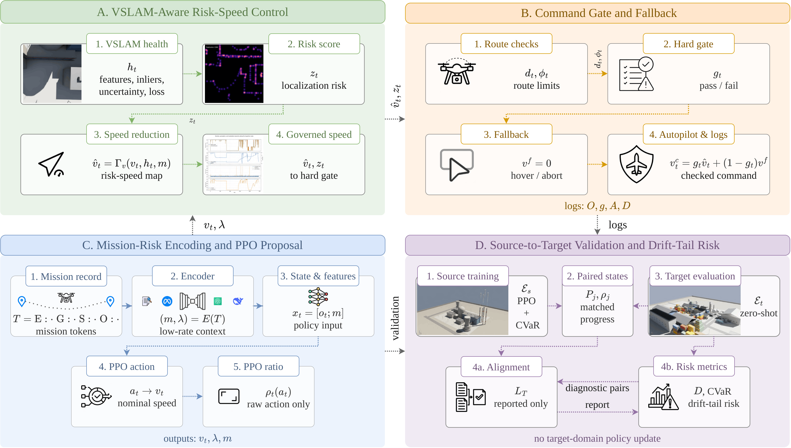
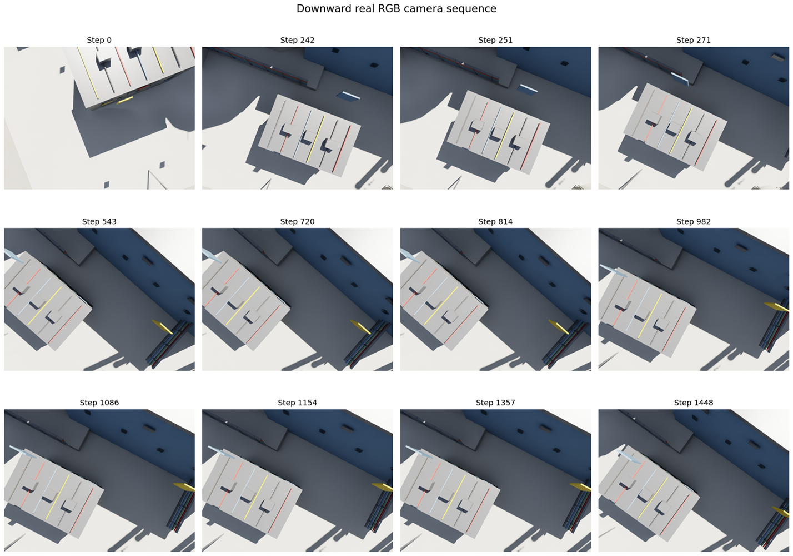
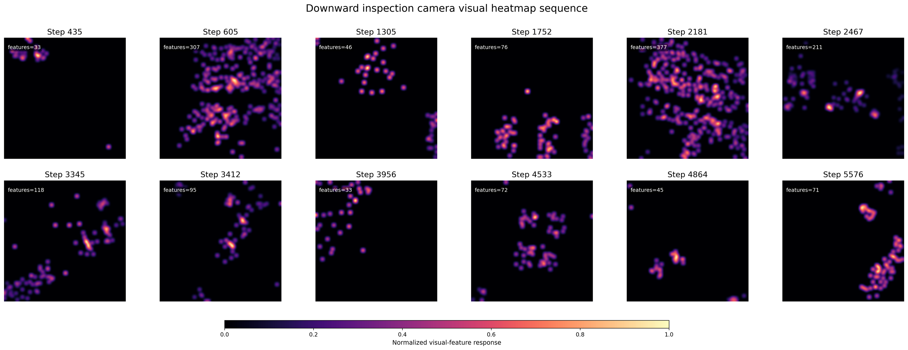
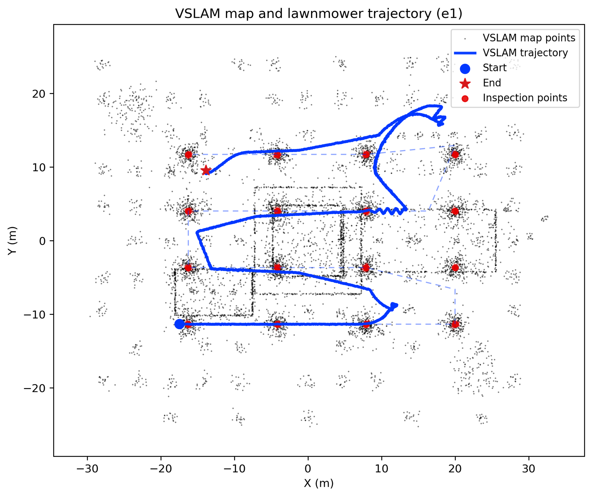
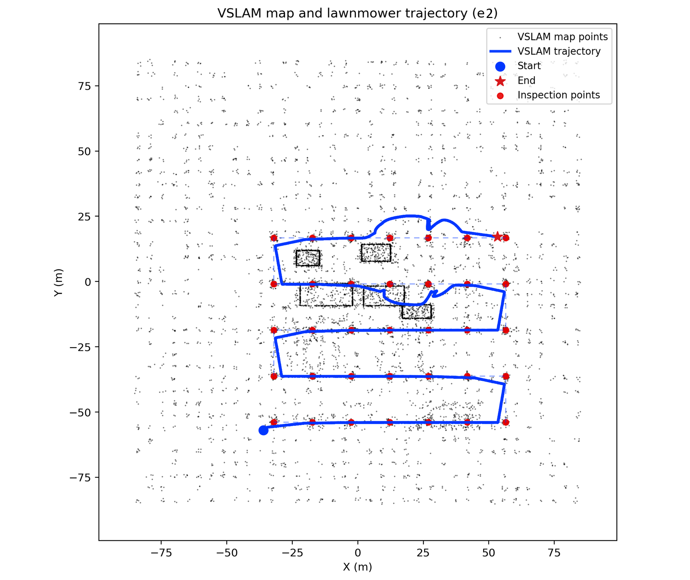
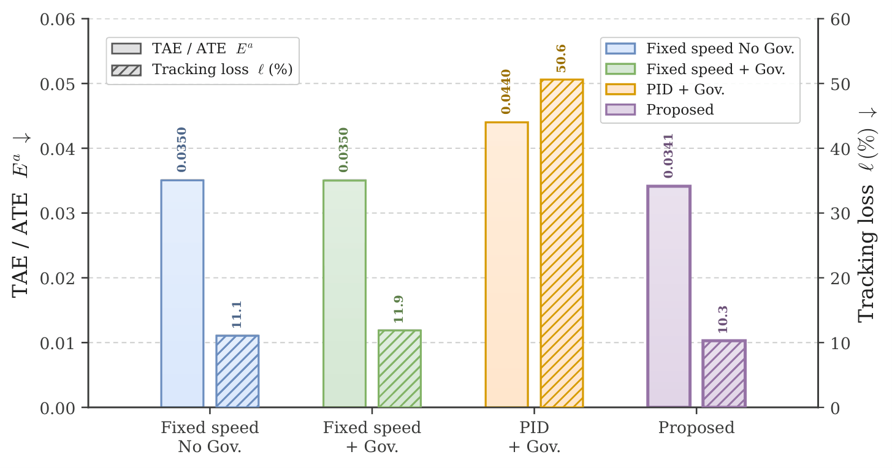
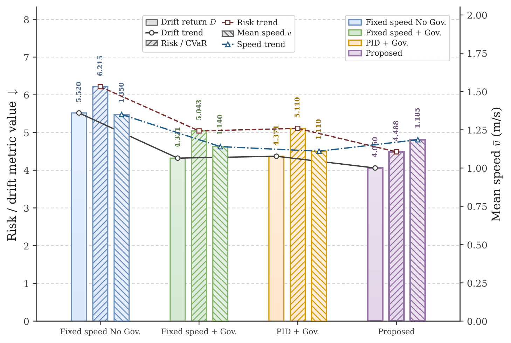
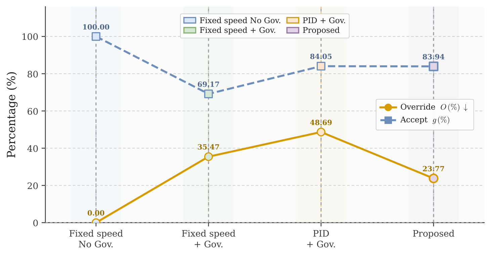

# Robust Speed Control for UAV Infrastructure Inspection Under Visual Localization Degradation

**Risk-aware speed control, VSLAM-health monitoring, and command checking for GPS-denied UAV inspection**

[](https://www.python.org/)
[](https://developer.nvidia.com/isaac/sim)
[](https://isaac-sim.github.io/IsaacLab/)
[](https://docs.ros.org/)
[](#method-summary)
[](#license)

> **Main idea:** A learned policy proposes a forward speed, but a deterministic command-checking layer verifies VSLAM risk, corridor deviation, yaw error, rate limits, and fallback conditions before the final command is executed.

---

## Overview

<p align="justify">
This repository provides the code, evaluation data, figures, and graphs for <b>Robust Speed Control for UAV Infrastructure Inspection Under Visual Localization Degradation</b>. The work studies GPS-denied UAV inspection in infrastructure scenes where visual localization can degrade because of weak texture, smoke, repetitive structures, lighting changes, motion blur, yaw uncertainty, or intermittent VSLAM tracking loss. The goal is not open-ended UAV navigation; the route is already planned. The core problem is how to regulate forward speed safely when localization quality changes along that route.
</p>

<p align="justify">
The framework separates <b>policy proposal</b> from <b>command execution</b>. A PPO-based speed policy proposes a bounded nominal speed. A VSLAM-aware risk-speed rule then adjusts the proposal using feature support, inlier quality, pose uncertainty, yaw uncertainty, tracking-loss status, and mission risk. Finally, a deterministic governor checks corridor error, yaw error, localization risk, tracking loss, speed limits, and abort conditions before the command reaches the simulated autopilot interface.
</p>

<p align="justify">
The repository name includes historical script names such as <code>uav_llm.py</code> and <code>uav_gpt.py</code>. In the setting, language is not used at the control rate. Mission text is converted once per episode into a compact numeric risk context, and the controller receives only this bounded mission vector and scalar risk preference.
</p>

---

## System View

<p align="justify">
The system is designed for planned-route infrastructure inspection. The UAV follows fixed route waypoints, observes scene and localization-health signals, proposes speed through the learned policy, applies risk-aware speed correction, and executes only the checked command. The evaluation uses a source power-plant scene and a target industrial scene to test zero-shot source-to-target behavior under VSLAM degradation.
</p>

<p align="center">
  
  
</p>

<p align="center"><b>Source and target inspection scenes used by the repository.</b></p>

## Unified Framework 

<p align="center">
  
</p>

<p align="justify">
The framework figure summarizes the complete control loop. The mission record is encoded once per episode into numeric context and a risk preference. The PPO policy samples a raw action and proposes a bounded speed, while VSLAM health produces a localization-risk score from feature support, inlier quality, pose uncertainty, yaw uncertainty, and tracking-loss signals. The stack-level governor then checks corridor error, yaw error, tracking loss, and risk thresholds before sending only the checked speed command to the autopilot interface. The same framework supports source-domain training and zero-shot target-domain evaluation through paired route-progress logs.
</p>

---

## Method Summary

### 1. VSLAM-risk-aware speed proposal

<p align="justify">
The learned policy observes the online inspection state and mission context, then proposes a nominal speed. The risk-speed rule reduces this speed when visual localization becomes weak. The VSLAM risk score increases when feature support or inlier quality decreases, when position or yaw uncertainty rises, or when tracking loss occurs. A rate limiter prevents abrupt speed jumps.
</p>

```text
state x_t = [online observation o_t ; mission context m]
policy action a_t -> nominal speed v_t
VSLAM health h_t -> localization risk z_t
risk-speed rule -> adjusted speed v_hat_t
command gate -> checked command v_c_t
```

### 2. Deterministic command checking

<p align="justify">
The final command is not the raw policy output. The governor verifies route-corridor error, yaw error, tracking-loss flag, localization risk, speed bounds, and abort thresholds. If the command violates the safety envelope, the system uses a fallback command such as hover or abort/return behavior. This makes every correction auditable in the logs.
</p>

```text
if corridor OK and yaw OK and VSLAM OK and risk below threshold:
    execute checked speed
else:
    execute fallback speed / hover / abort command
```

### 3. Mission-risk encoding

<p align="justify">
Mission text uses a closed template, for example <code>E:low-texture G:coverage S:feature-slow O:slow-smooth</code>. The mission encoder maps this record to a numeric vector and scalar risk preference once per episode. This gives the controller mission awareness without running an LLM during real-time control.
</p>

### 4. Source-to-target validation

<p align="justify">
The source policy is trained in a smoke-degraded power-plant environment and evaluated zero-shot in an industrial target environment. The validation reports route progress, localization error, tracking loss, governor overrides, gate acceptance, abort incidence, drift return, and CVaR drift. This emphasizes drift-tail behavior instead of route completion alone.
</p>

---

## Repository Layout

```text
uav-llm-drl-main/
├── code/
│   ├── uav_e2_eval_baselines.py       <- target-domain evaluation loader for source-trained PPO
│   ├── uav_e2_fixed_governor.py       <- target fixed-speed baseline with command governor
│   ├── uav_e2_fixed_no_governor.py    <- target fixed-speed baseline without governor
│   ├── uav_fixed_governor.py          <- source fixed-speed baseline with governor
│   ├── uav_fixed_no_governor.py       <- source fixed-speed baseline without governor
│   ├── uav_fix.py                     <- source-domain corrected/proposed PPO + governor workflow
│   ├── uav_gpt.py                     <- mission-conditioned source workflow variant
│   ├── uav_llm_e2.py                  <- target-domain proposed PPO + governor evaluation
│   ├── uav_llm.py                     <- main source-domain mission-conditioned PPO workflow
│   ├── uav_pid_e2.py                  <- target-domain PID + governor baseline
│   └── uav_pid.py                     <- source-domain PID + governor baseline
│
├── data/
│   ├── a.txt                          <- placeholder file for preserving the data folder
│   ├── e1.zip                         <- source-domain records and artifacts
│   ├── eval.zip                       <- evaluation logs/results archive
│   ├── other.zip                      <- auxiliary experiment files
│   ├── seeds.zip                      <- multi-seed logs and summaries
│   ├── speed.zip                      <- speed-control and sweep outputs
│   └── uav_llm.zip                    <- proposed method logs/checkpoints/artifacts
│
├── figs/
│   ├── e1/
│   │   ├── downcam_heatmap_sequence_ep0020.png
│   │   ├── downcam_rgb_sequence_ep0020.png
│   │   ├── episode_0020_bottom_visual_heatmap_sequence.png
│   │   └── episode_0020_vslam_trajectory.png
│   ├── e2/
│   │   ├── downcam_heatmap_ep0020.png
│   │   ├── downcam_rgb_sequence_ep0020.png
│   │   ├── episode_0020_bottom_visual_heatmap_sequence.png
│   │   └── episode_0020_vslam_trajectory.png
│   ├── framework.png                  <- overall risk-aware speed-control framework
│   ├── indust.png                     <- industrial target-domain visual
│   ├── inspect.png                    <- inspection and validation procedure
│   └── power.png                      <- power-plant source-domain visual
│
├── graphs/
│   ├── a.txt                          <- placeholder file for preserving the graph folder
│   ├── drift_speed_tradeoff.pdf       <- vector version of drift/speed trade-off graph
│   ├── drift_speed_tradeoff.png       <- GitHub-preview version of drift/speed trade-off graph
│   ├── override.pdf                   <- vector version of override/gate graph
│   ├── override.png                   <- GitHub-preview version of override/gate graph
│   ├── vslam_error_loss.pdf           <- vector version of ATE/tracking-loss graph
│   └── vslam_error_loss.png           <- GitHub-preview version of ATE/tracking-loss graph
│
└── README.md
```

---

## Code Tour

| Script | Main role | Typical use |
|---|---|---|
| `code/uav_llm.py` | Main source-domain PPO workflow with mission-risk context, VSLAM proxy, command checking, Isaac Sim scene generation, logging, and optional ROS 2 / cuVSLAM bridge hooks. | Train or evaluate the proposed policy in the source power-plant domain. |
| `code/uav_fix.py` | Corrected source-domain PPO/governor workflow used for stable  runs. | Re-run proposed source-domain training/evaluation with fixed settings. |
| `code/uav_llm_e2.py` | Target-domain proposed method evaluation script. | Load the source-trained policy and evaluate zero-shot in the industrial target domain. |
| `code/uav_e2_eval_baselines.py` | Target evaluation wrapper for the source-trained model and baseline comparison workflow. | Run target-domain evaluation with consistent logging. |
| `code/uav_fixed_no_governor.py` | Source fixed-speed baseline without command governor. | Isolate fixed-speed behavior without safety trimming. |
| `code/uav_fixed_governor.py` | Source fixed-speed baseline with deterministic governor. | Measure governor-only benefit without learned speed proposal. |
| `code/uav_e2_fixed_no_governor.py` | Target fixed-speed baseline without governor. | Target-domain no-governor baseline. |
| `code/uav_e2_fixed_governor.py` | Target fixed-speed baseline with governor. | Target-domain governor-only baseline. |
| `code/uav_pid.py` | Source PID speed scheduler with governor. | Compare learned speed proposal against a hand-tuned controller. |
| `code/uav_pid_e2.py` | Target PID speed scheduler with governor. | Zero-shot target PID baseline. |
| `code/uav_gpt.py` | Historical mission-conditioned workflow variant. | Ablation/debugging of mission-context encoding. |

---

## Data and Artifact Archives

<p align="justify">
The <code>data/</code> directory stores compressed experiment artifacts. These archives are useful when reproducing tables and figures without re-running all Isaac Sim episodes. Extract only the archives needed for the experiment you want to inspect.
</p>

```bash
# From repository root
mkdir -p extracted
unzip data/e1.zip -d extracted/e1
unzip data/eval.zip -d extracted/eval
unzip data/seeds.zip -d extracted/seeds
unzip data/speed.zip -d extracted/speed
unzip data/uav_llm.zip -d extracted/uav_llm
```

Suggested interpretation:

| Archive | Contents / purpose |
|---|---|
| `data/e1.zip` | Source-domain power-plant episodes, metrics, or visual artifacts. |
| `data/eval.zip` | Evaluation summaries and logs used for tables. |
| `data/seeds.zip` | Multi-seed records for robustness and variance checks. |
| `data/speed.zip` | Speed-control analysis, governor behavior, and sweep outputs. |
| `data/uav_llm.zip` | Proposed-method outputs, checkpoints, or mission-conditioned logs. |
| `data/other.zip` | Additional auxiliary files used during development. |

---

## Visual Results

<p align="center">
  
</p>

### Source-domain inspection artifacts

<p align="center">
  
</p>

<p align="justify">
These images show the source-domain visual stream and heatmap-style localization/feature-support artifacts from the power-plant inspection scene. They are useful for explaining why visual localization can degrade in smoke, repetitive structures, and weakly textured regions.
</p>

<p align="center">
  
</p>

### Target-domain inspection artifacts

<p align="center">
  
</p>

<p align="justify">
These images summarize the target industrial scene used for zero-shot evaluation. The target route is longer but visually easier because the scene contains more static and feature-rich structures than the smoke-degraded source scene.
</p>

<p align="center">
  
</p>

### VSLAM trajectories

<p align="center">
  
</p>

<p align="center">
  
</p>


---

## Requirements

### Recommended platform

- Ubuntu 20.04 / 22.04
- NVIDIA GPU with recent driver
- NVIDIA Isaac Sim and/or Isaac Lab environment
- Python 3.10+
- ROS 2 if using bridge or cuVSLAM-related topics
- Optional Hugging Face access if using the historical `llama_hf` mission encoder path

### Python packages

The scripts import standard scientific packages directly and load Isaac/Omniverse modules through Isaac Sim. A minimal Python layer is:

```bash
pip install numpy gymnasium stable-baselines3 torch transformers
```

For Isaac Sim / Isaac Lab execution, run the scripts through the Isaac Lab launcher so that `isaacsim`, `omni`, and `pxr` modules are available.

---

## Quick Start

### 1. Clone the repository

```bash
git clone https://github.com/szu-ai/uav-llm-drl.git
cd uav-llm-drl-main
```

### 2. Check the repository structure

```bash
find . -maxdepth 3 -type f | sort
```

### 3. Copy or reference the scripts from Isaac Lab

Option A: Run directly by absolute path through Isaac Lab:

```bash
cd ~/IsaacLab
./isaaclab.sh -p /path/to/uav-llm-drl-main/code/uav_llm.py --mode demo --headless
```

Option B: Copy the scripts into an Isaac Lab standalone folder:

```bash
mkdir -p ~/IsaacLab/source/standalone/uav_llm
cp /path/to/uav-llm-drl-main/code/*.py ~/IsaacLab/source/standalone/uav_llm/
cd ~/IsaacLab
./isaaclab.sh -p source/standalone/uav_llm/uav_llm.py --mode demo --headless
```

---

## Reproducing the Main Workflow

### A. Train the proposed source-domain policy

```bash
cd ~/IsaacLab
./isaaclab.sh -p /path/to/uav-llm-drl-main/code/uav_llm.py \
  --mode train \
  --headless \
  --device cuda \
  --seed 7 \
  --total-timesteps 500000 \
  --mission-text "E:low-texture G:coverage S:feature-slow O:slow-smooth" \
  --output-root ~/uav_results_e1_gui_llm
```

Expected checkpoint path:

```text
~/uav_results_e1_gui_llm/models/power_plant_ppo.zip
```

### B. Evaluate the proposed method in the source domain

```bash
cd ~/IsaacLab
./isaaclab.sh -p /path/to/uav-llm-drl-main/code/uav_llm.py \
  --mode eval \
  --headless \
  --device cuda \
  --eval-episodes 20 \
  --model-path ~/uav_results_e1_gui_llm/models/power_plant_ppo.zip \
  --output-root ~/uav_results_e1_eval
```

### C. Evaluate zero-shot in the target industrial domain

```bash
cd ~/IsaacLab
./isaaclab.sh -p /path/to/uav-llm-drl-main/code/uav_llm_e2.py \
  --mode eval \
  --headless \
  --device cuda \
  --eval-episodes 20 \
  --model-path ~/uav_results_e1_gui_llm/models/power_plant_ppo.zip \
  --output-root ~/uav_results_e2_eval
```

---

## Baseline Commands

### Fixed speed without governor — source domain

```bash
cd ~/IsaacLab
./isaaclab.sh -p /path/to/uav-llm-drl-main/code/uav_fixed_no_governor.py \
  --mode eval \
  --headless \
  --eval-episodes 20 \
  --fixed-speed 1.35 \
  --output-root ~/uav_results_fixed_no_gov_e1
```

### Fixed speed with governor — source domain

```bash
cd ~/IsaacLab
./isaaclab.sh -p /path/to/uav-llm-drl-main/code/uav_fixed_governor.py \
  --mode eval \
  --headless \
  --eval-episodes 20 \
  --fixed-speed 1.35 \
  --output-root ~/uav_results_fixed_gov_e1
```

### PID with governor — source domain

```bash
cd ~/IsaacLab
./isaaclab.sh -p /path/to/uav-llm-drl-main/code/uav_pid.py \
  --mode eval \
  --headless \
  --eval-episodes 20 \
  --output-root ~/uav_results_pid_e1
```

### Fixed speed without governor — target domain

```bash
cd ~/IsaacLab
./isaaclab.sh -p /path/to/uav-llm-drl-main/code/uav_e2_fixed_no_governor.py \
  --mode eval \
  --headless \
  --eval-episodes 20 \
  --fixed-speed 1.35 \
  --output-root ~/uav_results_fixed_no_gov_e2
```

### Fixed speed with governor — target domain

```bash
cd ~/IsaacLab
./isaaclab.sh -p /path/to/uav-llm-drl-main/code/uav_e2_fixed_governor.py \
  --mode eval \
  --headless \
  --eval-episodes 20 \
  --fixed-speed 1.35 \
  --output-root ~/uav_results_fixed_gov_e2
```

### PID with governor — target domain

```bash
cd ~/IsaacLab
./isaaclab.sh -p /path/to/uav-llm-drl-main/code/uav_pid_e2.py \
  --mode eval \
  --headless \
  --eval-episodes 20 \
  --output-root ~/uav_results_pid_e2
```

---

## Important Runtime Options

| Option | Meaning |
|---|---|
| `--mode train` | Train the source-domain PPO speed policy. |
| `--mode eval` | Load a checkpoint or run a baseline and collect metrics. |
| `--mode demo` | Run a visual/debug demonstration. |
| `--headless` | Run without GUI. Remove this flag for visual Isaac Sim rendering. |
| `--device cuda` | Use GPU for learning components where supported. |
| `--model-path` | Path to a trained PPO checkpoint. |
| `--output-root` | Directory for logs, metrics, figures, and checkpoints. |
| `--eval-episodes` | Number of evaluation episodes. |
| `--mission-text` | Closed mission template used by the mission-risk encoder. |
| `--slam-mode proxy` | Use the repeatable VSLAM proxy for controlled validation. |
| `--slam-mode cuvslam` | Use cuVSLAM-related odometry/bridge path when configured. |
| `--capture-rgb` | Save RGB/visual artifacts for figures. |
| `--disable-figures` | Disable figure generation for faster runs. |
| `--speed-min`, `--speed-max` | Speed bounds. |
| `--governor-alpha`, `--governor-beta` | VSLAM-risk and mission-risk speed reduction gains. |
| `--vslam-risk-limit` | Gate threshold for VSLAM risk. |
| `--corridor-limit`, `--yaw-limit-deg` | Route safety limits for command checking. |
| `--abort-risk-limit`, `--abort-corridor-limit`, `--abort-yaw-limit-deg` | Hard abort thresholds. |

---

## Metrics 

| Metric | Meaning | Direction |
|---|---|---:|
| `Speed v_bar^p` | Mean policy-proposed speed before the final gate. | Context dependent |
| `ATE E^a` | Absolute trajectory error. | Lower is better |
| `Track loss ell` | Percentage of VSLAM tracking-loss events. | Lower is better |
| `Override O` | Percentage of commands modified by the governor. | Lower is usually better |
| `Gate g` | Percentage of hard-gate accepted commands. | Higher is usually better |
| `Abort A` | Abort or hard-safety event incidence. | Lower is better |
| `Drift D` | Episode-level drift return from corridor, yaw, and tracking loss. | Lower is better |
| `CVaR drift` | Tail-risk drift score over worst episodes. | Lower is better |

---

## Target-Domain Results from the Evaluation

The work reports the following zero-shot target-domain comparison for the seed-7 checkpoint:

| Method | Speed `v_bar^p` (m/s) | ATE `E^a` (m) ↓ | Track loss `ell` (%) ↓ | Override `O` (%) ↓ | Gate `g` (%) | Drift `D` ↓ | CVaR ↓ |
|---|---:|---:|---:|---:|---:|---:|---:|
| Fixed speed without governor | 1.350 | 0.0350 | 0.111 | 0.000 | 100.000 | 5.520 | 6.215 |
| Fixed speed with governor | 1.140 | 0.0350 | 0.119 | 35.465 | 69.167 | 4.321 | 5.043 |
| PID speed control with governor | 1.110 | 0.0440 | 0.506 | 48.692 | 84.053 | 4.371 | 5.110 |
| Proposed PPO speed control with governor | 1.185 | **0.0341** | **0.103** | **23.772** | 83.943 | **4.060** | **4.488** |

<p align="justify">
These values show that the proposed policy-governor combination is not simply slower. It keeps a higher proposed speed than the fixed-governor and PID-governor baselines while reducing ATE, tracking loss, drift return, CVaR drift, and override rate in the target domain.
</p>

---

## Reproducing Graphs

The repository includes both vector PDF files and GitHub-preview PNG files:

```text
graphs/vslam_error_loss.pdf
graphs/vslam_error_loss.png
graphs/drift_speed_tradeoff.pdf
graphs/drift_speed_tradeoff.png
graphs/override.pdf
graphs/override.png
```

Use the PDF versions for papers and presentations that need vector quality. Use the PNG versions for GitHub README preview. If a PDF is updated and the PNG needs regeneration, run:

```bash
pdftoppm -png -singlefile -r 300 graphs/vslam_error_loss.pdf graphs/vslam_error_loss
pdftoppm -png -singlefile -r 300 graphs/drift_speed_tradeoff.pdf graphs/drift_speed_tradeoff
pdftoppm -png -singlefile -r 300 graphs/override.pdf graphs/override
```

---

## Suggested Experiment Order

1. Run `uav_llm.py --mode demo` to verify Isaac Sim and scene loading.
2. Run `uav_llm.py --mode train` for the source-domain PPO policy.
3. Run `uav_llm.py --mode eval` to evaluate source behavior.
4. Run `uav_llm_e2.py --mode eval` for target-domain zero-shot evaluation.
5. Run fixed-speed and PID baselines in both source and target domains.
6. Compare CSV logs using ATE, tracking loss, override rate, drift return, and CVaR drift.
7. Regenerate or update graphs in `graphs/`.

---

## Notes on VSLAM and ROS 2

<p align="justify">
The scripts support a repeatable simulation-side VSLAM proxy and include hooks for ROS 2 / cuVSLAM-style odometry and image bridge topics. The proxy is useful for controlled validation because it gives repeatable localization-health signals. It should not be interpreted as a replacement for a full field-ready SLAM backend.
</p>

Common VSLAM-related options include:

```text
--slam-mode proxy
--slam-mode gt
--slam-mode cuvslam
--cuvslam-odom-topic /visual_slam/tracking/odometry
--cuvslam-odom-udp-port 14555
--cuvslam-left-image-topic /visual_slam/image_0
--cuvslam-right-image-topic /visual_slam/image_1
--cuvslam-baseline 0.18
--cuvslam-img-width 640
--cuvslam-img-height 480
```

---

## Troubleshooting

### `isaacsim.SimulationApp unavailable`

Run the script through Isaac Lab instead of a normal Python interpreter:

```bash
cd ~/IsaacLab
./isaaclab.sh -p /path/to/uav-llm-drl-main/code/uav_llm.py --mode demo --headless
```

### `ModuleNotFoundError: stable_baselines3`

Install Stable-Baselines3 inside the Isaac Lab Python environment:

```bash
cd ~/IsaacLab
./isaaclab.sh -p -m pip install stable-baselines3 gymnasium
```

### No GUI or black window

Use headless mode for server runs:

```bash
--headless
```

For visualization, remove `--headless`, check that the display server is available, and ensure that the NVIDIA driver supports Isaac Sim rendering.

### Graph PDFs do not show inside GitHub README

GitHub may not render PDF files inline. Link the PDFs directly or convert them to PNG using `pdftoppm`.

### Target evaluation cannot find the model

Pass the checkpoint explicitly:

```bash
--model-path ~/uav_results_e1_gui_llm/models/power_plant_ppo.zip
```

---

## Safety and Deployment Notice

<p align="justify">
This repository is a research prototype for controlled simulation and pre-HIL validation. It is not a field-ready autopilot system. Before real UAV deployment, the controller must be tested with hardware-in-the-loop, calibrated for the site and UAV platform, integrated with certified failsafe behavior, supervised by a safety pilot, and checked under local aviation and inspection regulations.
</p>

---

## Graph Results

### VSLAM error and tracking loss

<p align="center">
  
</p>

<p align="justify">
This graph compares target-domain localization accuracy and VSLAM tracking-loss behavior. The proposed PPO speed controller with the governor gives the lowest governed ATE and tracking-loss rate among the evaluated controllers, showing that the learned speed proposal is better aligned with the VSLAM-risk envelope than fixed-speed or PID scheduling.
</p>

### Drift-speed trade-off

<p align="center">
  
</p>

<p align="justify">
This graph connects speed behavior with drift-tail risk. It shows that the proposed method is not simply slower; it keeps a higher proposed speed than the fixed-governor and PID-governor baselines while reducing drift return and CVaR drift. This is important because safe inspection should reduce localization-induced drift without unnecessarily crawling along visually reliable route segments.
</p>

### Governor override and gate behavior

<p align="center">
  
</p>

<p align="justify">
This graph summarizes command interventions and gate acceptance. A lower override rate means fewer policy proposals require correction by the governor. The proposed method reduces unnecessary interventions compared with fixed-speed plus governor and PID plus governor, while still keeping the command path checked against VSLAM risk, corridor error, yaw error, and fallback limits.
</p>
